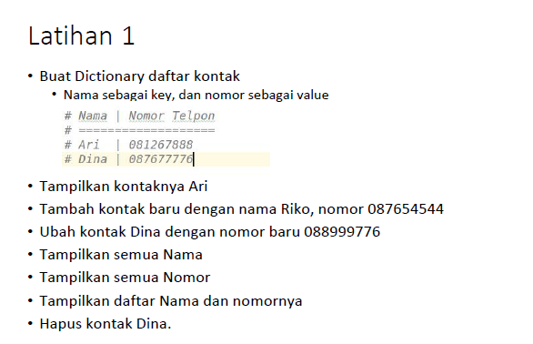
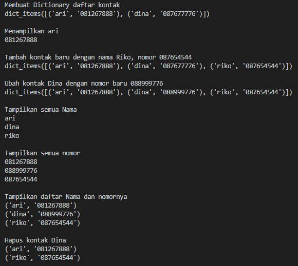

# Tugas pertemuan ke 9
Repository ini digunakan untuk memenuhi Tugas Bahasa Pemrograman - Pertemuan 9

Nama    : Dani Darmawan <br>
NIM     : 312010154 <br>
KELAS   : TI.20.B1 <br>

### DAFTAR ISI
| NO | DESCRIPTION | LINK |
| ---- | ----- | ----|
| 1 | Latihan  | [CLICK HERE](#latihan) |
| 2 | Praktikum ke 5  | [CLICK HERE](#Praktikum_Ke_5) |

## Latihan
Latihan soal pada pertemeuan ke 9 bagian ke 2 <br> 

Codingan saya [klik](Latihanp5.py)

Membuat Dictionary daftar kontak, nama sebagai **key**  dan nomor sebagai **value**<br>
dan jika kita memulai variabelnya dari 0 harus di ubah menjadi **string**, jika tidak akan muncul eror<br>
``` python
a = {'ari':"081267888", 
    'dina':"087677776",}
print(a.items())
```
Menampilkan ari menggunakan contoh syntax di bawah ini<br>
``` python
print(a['ari'])
```
Menambahkan dengan menggunakan syntax di bawah dengan key dan value baru atau yang ingin di tambahkan<br>
``` python
a['riko'] = "087654544"
print(a.items())
```
Ubah kontak Dina dengan nomor baru 08899977, karna yang di ubah nomornya berarti value yang di ubah bukan key nya<br>
``` python
a['dina'] = "088999776"
print(a.items())
```
Tampilkan semua Nama menggunakan perintah **for item in a.items():** agar yang di tampilkan<br>
yanga terbaru dan mengurut kebawah.<br>
``` python
for item in a.items():
    print(item[0])
```
Tampilkan semua nomor
``` python
for item in a.items():
    print(item[1])
```
Tampilkan daftar Nama dan nomornya
``` python
for item in a.items():
    print(item)
```
Hapus kontak Dina dengan cara memasukan fungsi **del** terlebih dahulu
``` python
del a['dina']
for item in a.items():
    print(item)
```
**Output dari Inputan di atas**


## Praktikum_Ke_5
